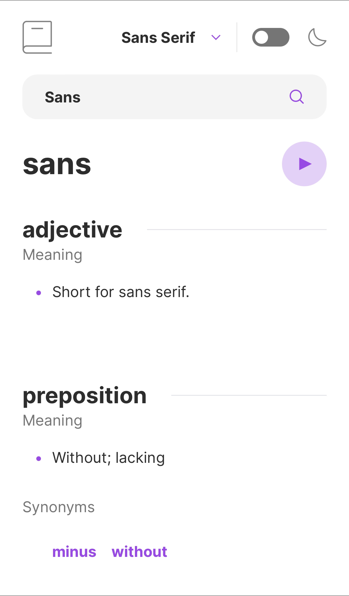
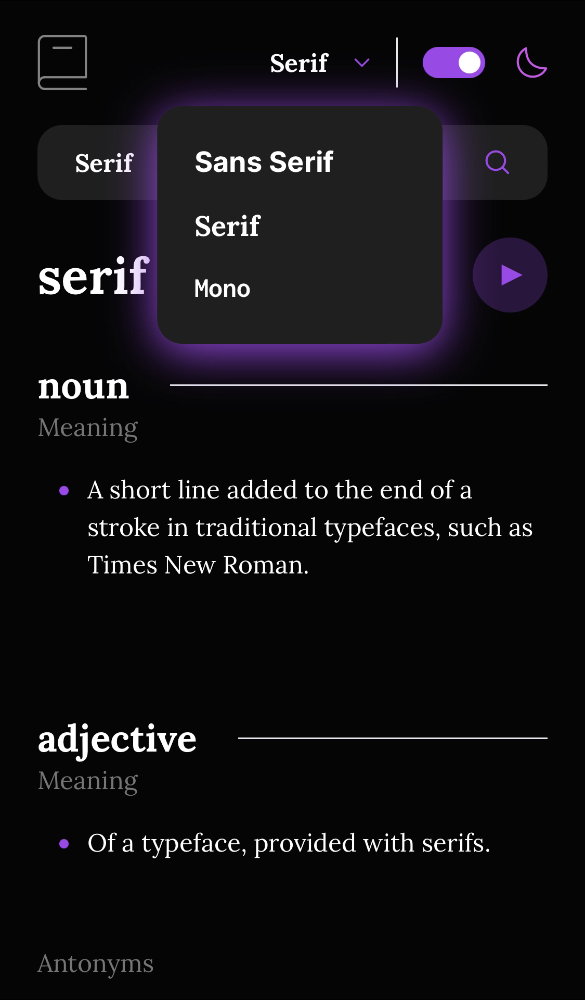
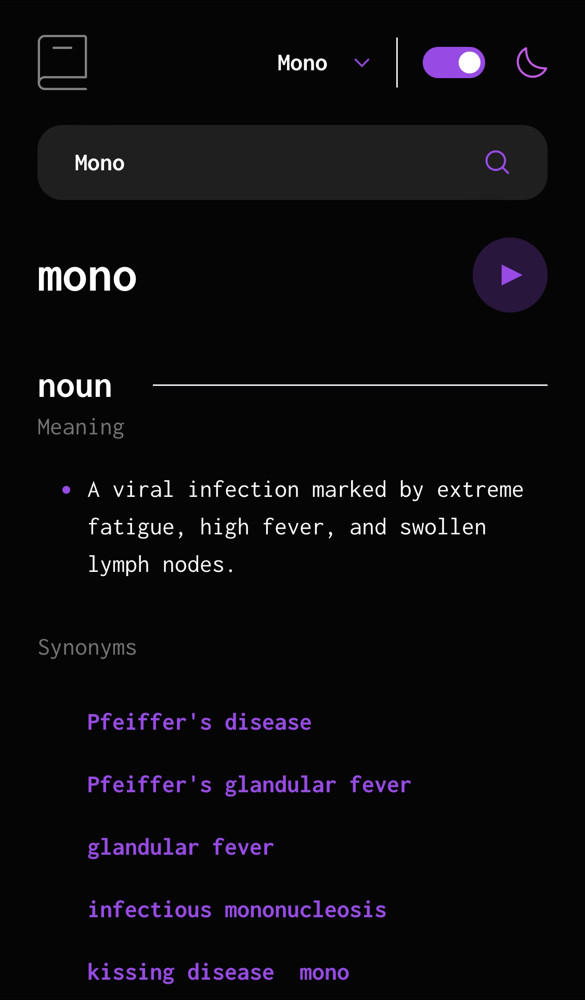

# Dictionary Web App

This is a solution to Frontend Mentor's [Dictionary web app challenge](https://www.frontendmentor.io/challenges/dictionary-web-app-h5wwnyuKFL) with bonus added functionality.

## Links

- [Live Link](https://dictionary-web-app-omaralseddik.vercel.app/)
- [Solution Link](https://www.frontendmentor.io/solutions/nextjs-v13-app-router-typescript-tailwind-nIn_WTIcX9)

## Features

- English -> English dictionary with audio.
- The project utilizes SSG (Static Site Generation) for blazingly fast loading times.
- Options to change the theme and font family of the web app, both of which are saved on the local storage.
- Sleek and fully responsive design.

## Tech Stack

- Next.js (v13)
- TypeScript
- Tailwind

## Desktop Screenshots

  
   

## Mobile Screenshots

  
  
   

